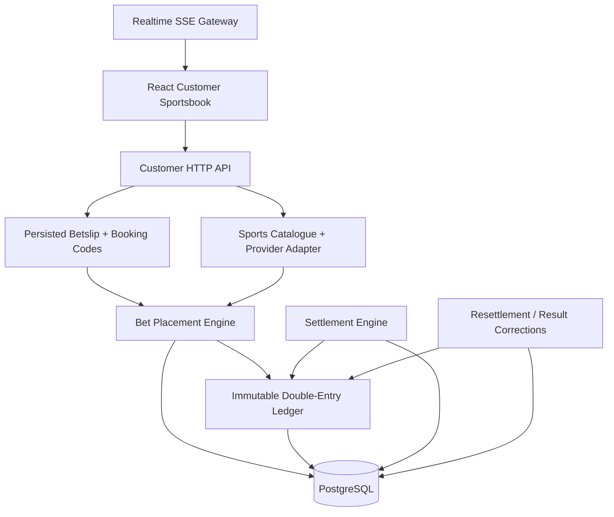

# BTE — Open-Source Play-Money Sportsbook Engine

**BTE is an open-source, play-money sportsbook engine and sports betting platform reference implementation focused on transactional correctness, realtime market state, immutable accounting, and production-grade betting workflows.**

Built with **TypeScript, Node.js, React, Vite, Prisma, and PostgreSQL**, BTE implements the difficult parts of a modern sportsbook: server-authoritative odds, atomic bet placement, a double-entry ledger, persisted betslips and booking codes, realtime SSE updates, settlement, append-only result corrections, and a responsive customer sportsbook UI.

> **Play money only.** Real-money operation is intentionally not part of the public BTE distribution.

BTE is useful both as a sportsbook reference architecture and as a broader example of how to design concurrent, auditable transaction systems.

## Why BTE exists

Most demo betting apps stop at UI screens and mutable balances.

BTE focuses on the failure-prone systems behind the interface:

- what happens when two requests try to spend the same wallet balance;
- how accepted odds are frozen without trusting the browser;
- how bet acceptance and stake debit commit atomically;
- how realtime price/state updates reconnect without regressing;
- how settlements remain idempotent;
- how corrected results reverse and re-award value without rewriting history;
- how booking codes load current prices instead of pretending historical quotes are reserved.

The result is an original, fixture-driven, play-money sportsbook platform with a transaction model intended to be inspectable, testable, and reusable.

## Capabilities

| Area | Implemented |
|---|---|
| Sports catalogue | Canonical sports/events/markets/outcomes, provider isolation, deterministic fixture provider |
| Realtime odds | SSE stream, monotonic entity versions, reconnect replay/resync, score/clock/state updates |
| Betslip | Persisted draft slips, selection replacement, stake persistence, explicit changed-price acceptance |
| Booking codes | Human-safe codes, TTLs, atomic max-use limits, current-price loading/import |
| Bet placement | Atomic stake debit + bet persistence, server-authoritative validation, idempotency |
| Wallet | Immutable double-entry ledger, integer minor units, derived balances, concurrency-safe debits |
| Settlement | WON / LOST / VOID / PARTIAL_VOID accounting with atomic payout/refund |
| Corrections | Append-only resettlement revisions, reversal + re-award accounting, stale-version protection |
| History & receipts | Open/settled history, immutable bet references and ledger transaction references |
| Customer UI | Responsive React sportsbook, desktop betslip, mobile sheet, My Bets, results/promos/help surfaces |
| Realtime UI | Live clocks/scores/stats, price flashes, trading suspension state |
| Verification | 86 tests plus typecheck, lint, production build, migration replay and upgrade checks |

## Architecture



BTE starts as a modular monolith. Domain boundaries are explicit enough that provider ingestion, realtime delivery, wallet/accounting, settlement, and operator integrations can be separated later without changing the core transaction rules.

## Core invariants

These rules are more important than any individual feature:

- **Money uses integer minor units.**
- **Wallet balance is derived from immutable ledger entries.** There is no mutable user balance column.
- **The browser is never authoritative for odds, balance, or market state.**
- **Bet acceptance and stake debit are atomic.**
- **Accepted price/version snapshots are immutable on bet legs.**
- **Idempotency keys prevent duplicate monetary effects.**
- **Concurrent requests cannot overspend one wallet.**
- **Realtime entity versions reject stale or duplicate updates.**
- **Settlement and payout/refund commit atomically.**
- **Corrected results append revisions rather than rewriting previous settlements.**
- **Ordinary customer writes cannot use the negative/frozen-wallet accounting bypasses reserved for authoritative corrections.**
- **The public application operates with deterministic fixtures and play money only.**

## Current implementation

BTE has been built in eight verified slices:

1. **Sports domain + deterministic fixture provider**
2. **Immutable wallet + double-entry ledger**
3. **Atomic, idempotent bet placement**
4. **Settlement + payout/refund + bet history**
5. **Persisted betslip + booking/load codes**
6. **Realtime market stream + SSE reconnect**
7. **Responsive customer sportsbook UI**
8. **Append-only result corrections + resettlement accounting**

See [SPORTSBOOK_MASTER_PLAN.md](SPORTSBOOK_MASTER_PLAN.md) for the detailed implementation roadmap and remaining product work.

## Quick start

### Requirements

- Node.js 24
- pnpm 11
- PostgreSQL

Direct application dependencies are pinned in `package.json` and `pnpm-lock.yaml`.

### 1. Configure PostgreSQL

After cloning the repository:

```bash
cp env.example .env
```

The default example expects a local PostgreSQL database named `bte_dev`. Adjust `DATABASE_URL` in `.env` for your environment.

### 2. Install and migrate

```bash
pnpm install
pnpm run db:migrate
```

### 3. Start the API and realtime fixture feed

```bash
pnpm run dev:api
```

By default the API listens on:

```text
http://127.0.0.1:4100
```

Startup creates the deterministic demo context and idempotently grants the demo user **₦50,000 in play money**.

### 4. Start the customer sportsbook

In a second terminal:

```bash
pnpm run dev:web
```

Open:

```text
http://127.0.0.1:5173
```

You can now select odds, persist stake, create/load booking codes, place a play-money bet, inspect the receipt, follow realtime updates, and view open/settled bets.

## Production-style local build

```bash
pnpm run build
pnpm start
```

The Node server serves the compiled customer SPA from `web-dist/` together with the API and SSE endpoint.

## Demo workflow

A typical BTE transaction path is:

```text
fixture catalogue
  → select outcome
  → persisted betslip
  → authoritative quote reconciliation
  → explicit changed-price acceptance when required
  → prepare placement
  → server revalidates event/market/outcome/price
  → lock wallet / verify funds
  → ledger stake debit + accepted bet in one transaction
  → immutable receipt
  → settlement
  → payout/refund
  → optional later result correction
  → reversal + corrected entitlement
  → audit/history
```

Booking codes are snapshots, **not price reservations**. Loading a code re-queries current authoritative state and surfaces changed, suspended, or unavailable selections.

## Repository layout

```text
src/
  app/          customer API + server
  betting/      atomic bet placement
  betslip/      persisted slips + booking codes
  realtime/     canonical stream, client state, SSE
  settlement/   settlement + append-only corrections
  sports/       canonical sports domain + fixture provider
  wallet/       money primitives + immutable ledger

web/
  src/          React customer sportsbook

prisma/
  schema.prisma
  migrations/

tests/
  domain, concurrency, realtime and HTTP integration tests

docs/research/
  normalized product/architecture research and open questions
```

## Betting engine

The placement engine does not accept a browser-supplied quote as truth.

For every submitted leg it resolves the current event, market, outcome and price from the server-side provider contract. It verifies market state and expected price/version, snapshots the accepted quote, then commits stake accounting and bet persistence in one PostgreSQL transaction.

Serializable transactions, row locking, uniqueness constraints, idempotency and bounded conflict retries protect duplicate submission and concurrent overspend paths.

## Double-entry ledger

BTE does not store a mutable wallet balance.

Balances are derived from immutable ledger entries:

```text
balance = total credits - total debits
```

Financial transactions carry their own idempotency key, reference type, reference ID and balanced debit/credit entries.

The ledger can participate in a caller-owned Prisma transaction, allowing domain state and its monetary effect to succeed or roll back together.

## Realtime odds and market state

The realtime subsystem publishes canonical price, market-state, event-state, score, clock, period and match-stat updates.

Important properties include:

- monotonically increasing global stream sequence;
- per-entity versions;
- stale/duplicate update rejection;
- bounded replay history;
- `Last-Event-ID` reconnect support;
- authoritative snapshot fallback when a reconnect cursor is too old;
- client-side sequence-gap detection;
- a provider overlay that feeds accepted realtime state back into transaction-time validation.

The customer UI uses this stream for live scores, price movement flashes and suspended trading states.

## Settlement and result corrections

Initial settlement supports:

- **WON**
- **LOST**
- **VOID**
- **PARTIAL_VOID**

Void legs are removed from multiple odds. An all-void bet refunds the original stake.

Result corrections do not mutate the previous settlement. A newer result version appends a new settlement revision, records which revision it supersedes, reverses the previous entitlement, and applies the corrected entitlement.

This makes the accounting chain auditable even when a previously paid result is corrected after winnings have already been spent.

## Testing

Run the complete verification gate:

```bash
pnpm run typecheck
pnpm run lint
pnpm test
pnpm run build
pnpm exec prisma migrate status
```

The current repository has **88 automated tests** covering, among other things:

- money safety;
- provider normalization;
- stale quote rejection;
- duplicate placement;
- concurrent wallet spending;
- transaction rollback;
- suspended markets;
- booking-code limits;
- realtime reconnect/gap behavior;
- concurrent settlement;
- partial voids;
- result correction replay;
- negative-balance clawback accounting;
- HTTP customer flow from bootstrap through receipt/history;
- encoded static-path traversal rejection and baseline response security headers.

Migration work has also been verified by replaying the complete migration chain and testing the Slice 08 upgrade against an isolated database containing historical settlement data.

GitHub Actions CI is defined in `.github/workflows/ci.yml`. It provisions PostgreSQL, installs with a frozen pnpm lockfile, applies all migrations, checks migration status, typechecks, lints, runs the complete test suite, and produces the production build.

## Runtime configuration

| Variable | Required | Default | Purpose |
|---|---:|---|---|
| `DATABASE_URL` | yes | — | PostgreSQL connection string used by Prisma |
| `HOST` | no | `127.0.0.1` | Node customer server bind host |
| `PORT` | no | `4100` | Node customer server port |
| `REALTIME_TICK_MS` | no | `4000` | Deterministic realtime fixture interval; minimum 250 ms |

Never commit production credentials. `.env` and `.env.*` are ignored.

## What BTE intentionally does not include

BTE is **not** a turnkey real-money betting operator.

The public distribution does not provide:

- a gambling licence or jurisdiction-specific legal approval;
- production payment or withdrawal rails;
- KYC/AML vendors;
- production geofencing;
- licensed commercial sports-data feeds;
- certified casino/RNG content;
- fraud/risk operations;
- production secrets or operator infrastructure;
- a claim that play-money defaults are sufficient for regulated real-money deployment.

Future payment, identity, provider, risk and operator integrations should remain behind explicit interfaces and should not weaken the transaction/accounting invariants above.

## Roadmap

The eight core implementation slices are complete.

Later product work includes:

- cashout pricing/acceptance;
- sandbox payment-provider integrations and reconciliation;
- richer Singles / System / Bet Builder semantics;
- promo/bonus mechanics;
- authentication and account lifecycle;
- KYC, responsible-gaming and compliance controls;
- operator/admin tooling;
- provider-backed games, virtuals and jackpot;
- security/load/chaos hardening;
- packaging and deployment improvements.

See [SPORTSBOOK_MASTER_PLAN.md](SPORTSBOOK_MASTER_PLAN.md) for the source-of-truth roadmap.

## Open-source licence

BTE is licensed under the **GNU Affero General Public License version 3 only** (`AGPL-3.0-only`).

See [LICENSE](LICENSE) for the complete licence text.

The AGPL is a strong copyleft licence with network-use provisions. If you modify BTE and make that modified version available for users to interact with over a network, review the obligations in AGPL section 13, including corresponding-source availability.

This README is a project overview, not legal advice.

## Commercial licensing

Organizations that require terms different from the AGPL may contact the copyright holder about a separate commercial licence.

See [COMMERCIAL-LICENSE.md](COMMERCIAL-LICENSE.md).

## Security

Please do not report suspected vulnerabilities in public issues.

See [SECURITY.md](SECURITY.md) for the supported reporting process and scope.

## Contributing

External contributions are welcome under the process in [CONTRIBUTING.md](CONTRIBUTING.md).

Because BTE is intended to support both the AGPL community distribution and separate commercial licensing, significant external code contributions require acceptance of the [BTE Contributor Licence Agreement](CLA.md) before merge.

The CLA does not transfer ownership of a contributor's work; it grants the project the rights needed to distribute contributions under the AGPL community licence and separately negotiated commercial licences.

## Copyright

Copyright © 2026 **Princely Ondotimi**.

See [NOTICE.md](NOTICE.md) for project notices.
